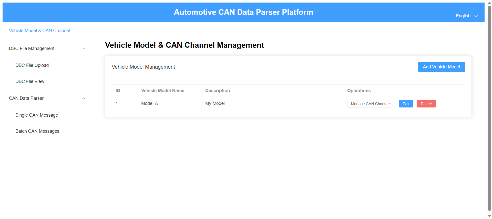
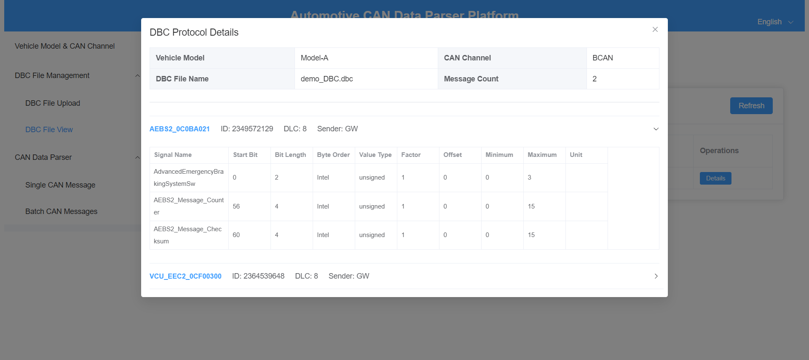
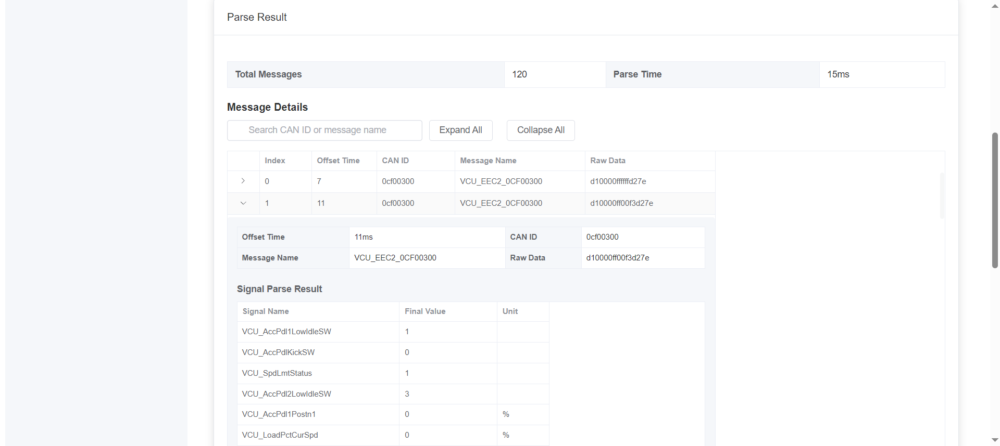
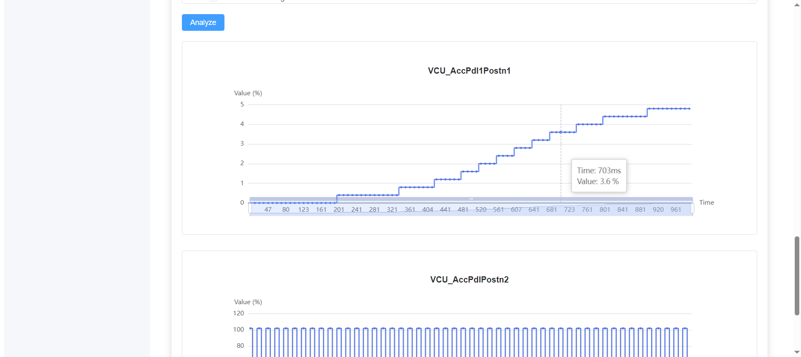

# 🚗 Automotive CAN Data Parser & Visualization Platform

A high-performance, web-based tool for decoding CAN 2.0 messages and visualizing vehicle signals in real-time.

---

## ✨ Key Features
* **DBC Lifecycle Management**: Upload, parse, and manage `.dbc` files with an embedded SQLite database.
* **High Performance**: Decode **1,000+ messages in <50ms** using a optimized Java 11 engine.
* **Signal Visualization**: Interactive ECharts integration for multi-signal curve analysis (Zoom/Drag/Export).
* **Developer Friendly**: Clean architecture with **Spring Boot 3.2** and **Vue 3 (Vite)**.
* **Bilingual Support**: Instant toggle between English and Chinese UI.

---

## 📸 Screenshots





---

## 🛠️ Tech Stack
| Layer | Framework / Tool |
| :--- | :--- |
| **Backend** | Java 11, Spring Boot 3.2, Spring Data JPA |
| **Frontend** | Vue 3.0, Vite, Element Plus, ECharts |
| **Database** | SQLite (Zero-configuration) |

---

## 🚀 Getting Started

### 1. Backend Setup
1. Ensure **JDK 11** is installed.
2. Navigate to `/backend` and run:
   ```bash
   mvn clean compile
   mvn spring-boot:run
   ```
   
### 2. Frontend Setup
1. Ensure Node.js (v18+) is installed.
2. Navigate to `/frontend` and run:
   ```bash
   npm install
   npm run dev
   ```
   
## 📄 License & Source Code

This project is available in different tiers (Standard/Developer/Enterprise).
To access the full source code and commercial license, please visit:

👉 **[Click here to get it on Gumroad ↗️](https://duoyunan.gumroad.com/l/candataparserplatform)**

*Includes lifetime updates and a commercial-friendly license.*

Note: This platform currently supports CAN 2.0 (Standard/Extended). CAN-FD is not supported.
